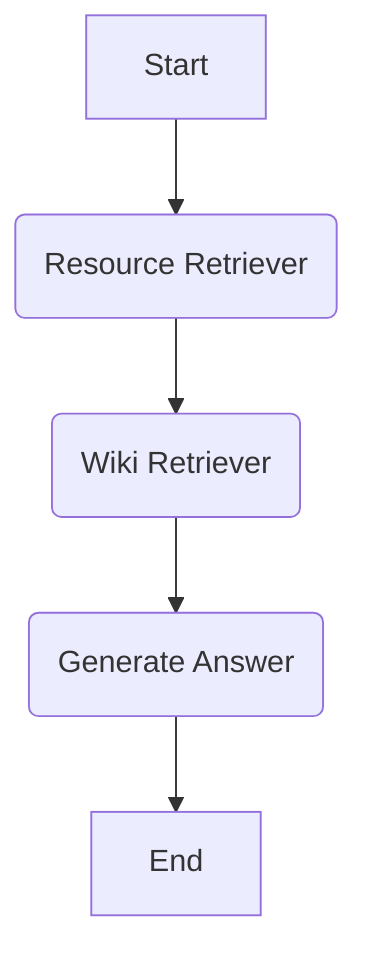

# Ordis RAG

Ordis RAG is a Retrieval Augmented Generation (RAG) system designed to answer questions, primarily focusing on Warframe-related queries by leveraging information from the Warframe Wiki. It uses a LangGraph-based agent architecture to process user input, retrieve relevant information, and generate informed responses.

## Setup

To set up the project, follow these steps:

1.  **Clone the repository:**
    ```bash
    git clone https://github.com/your-repo/ordis-rag.git
    cd ordis-rag
    ```

2.  **Install dependencies using Poetry:**
    ```bash
    poetry install
    ```

3.  **Create a `.env` file:**
    Create a file named `.env` in the root directory of the project and add your API keys. For example:
    ```
    GOOGLE_API_KEY="your_google_genai_api_key"
    TAVILY_API_KEY="your_tavily_api_key" # Required if websearch is enabled
    ```

## How to Run

To start the Ordis RAG agent, run the following command:

```bash
poetry run python -m ordis_rag
```

## Agent Architecture

The Ordis RAG agent operates through a defined flow to process user queries and generate answers. The current active flow is illustrated below:



### Flow Explanation:

*   **Resource Retriever:** This node analyzes the user's question to identify specific Warframe resources (e.g., Warframes, weapons, mods) mentioned or implied.
*   **Wiki Retriever:** Based on the identified resources, this node fetches relevant information from the Warframe Wiki.
*   **Generate Answer:** Finally, the Language Model (LLM) uses the retrieved wiki content to formulate a comprehensive and accurate answer to the user's question.

## Retrieval Augmented Generation (RAG)

Ordis RAG employs a RAG approach to enhance the quality and factual accuracy of its responses. By first retrieving information from a trusted knowledge base (the Warframe Wiki) and then using an LLM to synthesize this information, the system can provide more informed and contextually relevant answers than a standalone LLM.
